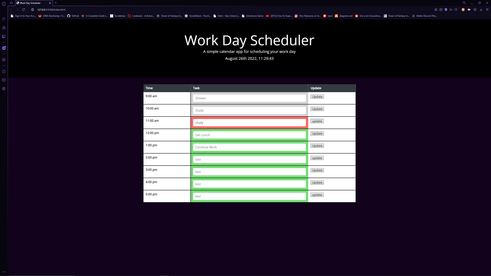

# Work Calendar #

## Description ##
A simple calendar for tracking your day at work.

## Table of Contents ##
* [Description](#Description "Goto Description")
* [Installation](#installation "installation")
* [Usage Info](#Usage-Info "Usage-Info")
* [Images](#Images "Goto Images")
* [License](#License "Goto License")
* [Questions](#Questions "Goto Questions")

## Installation ##
Go website listed Here - [Click Me](https://deamonbunny.github.io/work-calendar/ "Work Calendar")

## Usage Info ##
- Go to Website listed here - [Click Me](https://deamonbunny.github.io/work-calendar/ "Work Calendar")
- Enter information into the center sections of the boxes and click save.
- upon returning the data will still be there.

## Images ##

## License ##
MIT

## Questions ##
Reach my GitHub Account, [deamonbunny](https://github.com/deamonbunny "My GitHub")
